<div align="center">


<br/>


<br/><br/>

<a href="https://www.linkedin.com/in/derek-o-halloran/">
  
</a>&nbsp;
<a href="mailto:ohalloran.derek@gmail.com">
  
</a>&nbsp;
<a href="https://public.tableau.com/app/profile/derek.o.halloran/viz/Portfolio_54/Story1">
  
</a>&nbsp;
<a href="https://github.com/ohderek/business-intelligence-portfolio">
  
</a>

</div>

---

## `$ whoami`

```python
derek = {
    "role":   "Senior Data Engineer | BI Engineer",
    "based":  "Canada 🇨🇦 | Ireland 🇮🇪",
    "focus":  ["Pipeline Architecture", "Data Modelling", "Analytics Engineering", "Business Intelligence"],
    "stack": {
        "orchestration":  ["Apache Airflow", "Prefect"],
        "transformation": ["dbt Core", "PySpark", "PyArrow"],
        "warehousing":    ["Snowflake", "BigQuery", "Databricks / Delta Lake"],
        "languages":      ["Python", "SQL", "Bash"],
        "infra":          ["Terraform", "Docker", "GitHub Actions", "GCP"],
        "bi":             ["Looker / LookML", "Tableau", "Mode", "Thoughtspot"],
        "quality":        ["Great Expectations", "dbt tests", "dbt_project_evaluator"],
    },
}
```

---

## ◈ The Data Engineering Stack

> The right tool for the right layer. Each technology occupies a distinct position across the **declarative ↔ imperative** and **batch ↔ real-time** axes — and knowing where to reach for which one is the discipline.

```mermaid
quadrantChart
    title Data Tools — Execution Model
    x-axis "Declarative" --> "Imperative"
    y-axis "Batch" --> "Real-time"
    quadrant-1 Stream Processing
    quadrant-2 Managed Streaming
    quadrant-3 Warehouse-native
    quadrant-4 Orchestration & Transform
    dbt: [0.12, 0.08]
    Snowflake: [0.22, 0.13]
    BigQuery: [0.26, 0.16]
    Airflow: [0.62, 0.28]
    Prefect: [0.68, 0.35]
    Spark: [0.72, 0.62]
    Databricks: [0.70, 0.72]
    Kafka: [0.80, 0.92]
```



**dbt and Snowflake** anchor the warehouse-native quadrant — declarative SQL that belongs in version control. **Airflow and Prefect** sit in orchestration: Python-first, batch-oriented, dependency-aware. **Databricks and Spark** bridge batch and real-time workloads. **Kafka** is the only pure stream-processing tool in the stack.

---

## ◈ Pipeline Architecture

```mermaid
flowchart LR
    subgraph SRC["Sources"]
        A["REST APIs\nhttpx · PyArrow"]
        B["Fivetran\nConnectors"]
        C["Auto Loader\nDelta cloudFiles"]
    end

    subgraph LAKE["Medallion / Warehouse"]
        D[("Bronze\nRaw · source-faithful")]
        E[("Silver\nCleaned · keyed · validated")]
        F[("Gold\nAggregated · pre-modelled")]
    end

    subgraph DBT["dbt Core"]
        G["stg_  Staging\ntype casts · PII hash · dedup"]
        H["int_  Intermediate\nbusiness logic · unions"]
        I["fct_ / dim_  Marts\nincremental · surrogate keys"]
    end

    subgraph SERVE["Serve"]
        J[("Snowflake\nWarehouse")]
        K["Looker · Tableau\nBI Layer"]
    end

    A -->|Prefect / Airflow| D
    B --> D
    C --> D
    D --> E
    E --> F
    D --> G
    E --> G
    G --> H --> I --> J
    F --> J
    J --> K
```



**Ingestion** is handled by either Fivetran connectors (Approach 1) or custom Prefect flows writing Parquet to GCS/S3 then COPY INTO Snowflake (Approach 2). **dbt** runs the transformation layer — staging is a thin rename-and-cast layer, intermediate holds business logic, marts are analyst-facing and incrementally loaded.

---

## ◈ Featured Projects

<div align="center">

| Project | Stack | Highlights |
|---|---|---|
| [**NYC Taxi Lakehouse**](https://github.com/ohderek/data-engineering-portfolio/tree/main/lakehouse-medallion) | `Databricks` `Delta Lake` `PySpark` | Bronze→Silver→Gold · Auto Loader · Z-ORDER · DLT expectations · Unity Catalog |
| [**Operational Performance**](https://github.com/ohderek/data-engineering-portfolio/tree/main/operational-performance) | `Airflow` `Prefect` `dbt` `Snowflake` | Incident + AI DX metrics · Jinja multi-workspace unions · stage-and-merge ETL |
| [**GitHub Insights**](https://github.com/ohderek/data-engineering-portfolio/tree/main/github-insights) | `dbt` `Prefect` `PyArrow` `Fivetran` | Two ingestion approaches · 7-stage DORA lead time · SHA + time-based deployment matching |
| [**CoinMarketCap → Snowflake**](https://github.com/ohderek/data-engineering-portfolio/tree/main/crypto-market-data) | `Python` `httpx` `PyArrow` | Paginated REST client · 429 rate-limit handling · Parquet → COPY+MERGE |
| [**BI Portfolio**](https://github.com/ohderek/business-intelligence-portfolio) | `Looker` `LookML` `Tableau` | 11-table LookML model · DORA dashboard-as-code · Tableau public vizzes |

</div>

---

## ◈ Tech Stack

<div align="center">


<br/><br/>


<br/>


</div>

---

<div align="center">


</div>
